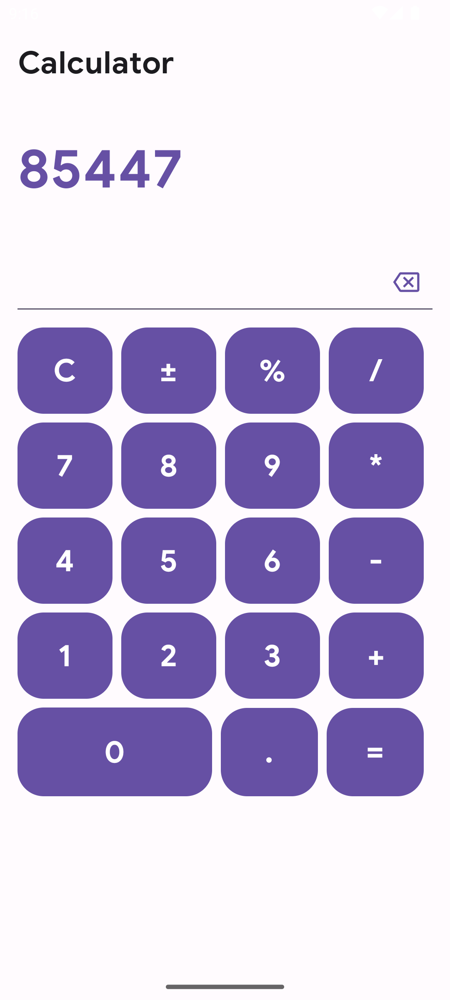
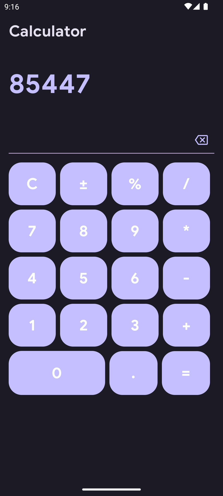
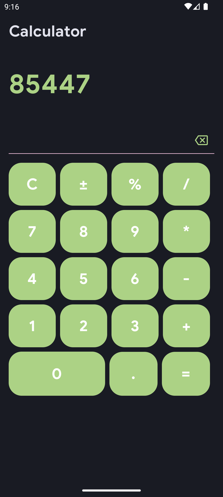

# Android Calculator

# 📖 About
## 💻 Tech Stack
- Jetpack Compose
- Dependency Injection with Dagger-Hilt
- Kotlin Coroutines
- Accompanist
- Material3
- Clean Architecture
- MVVM

## 📱 Screenshots
⬜ Dynamic Theme for Android 13+

    
    
    

